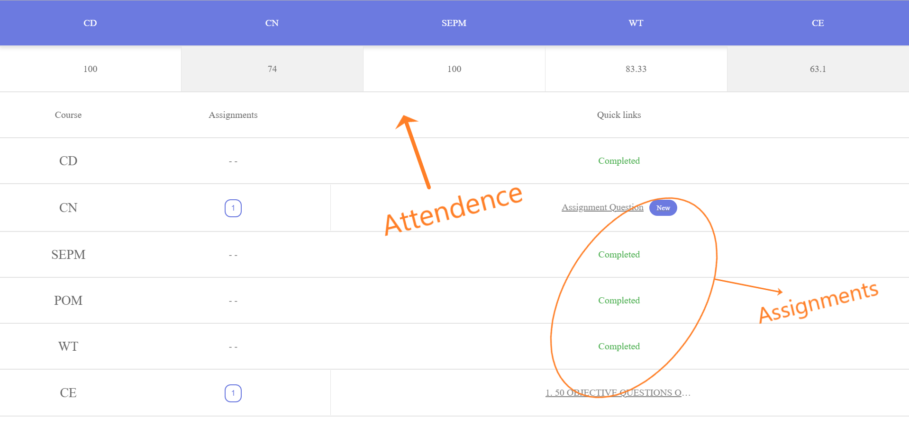
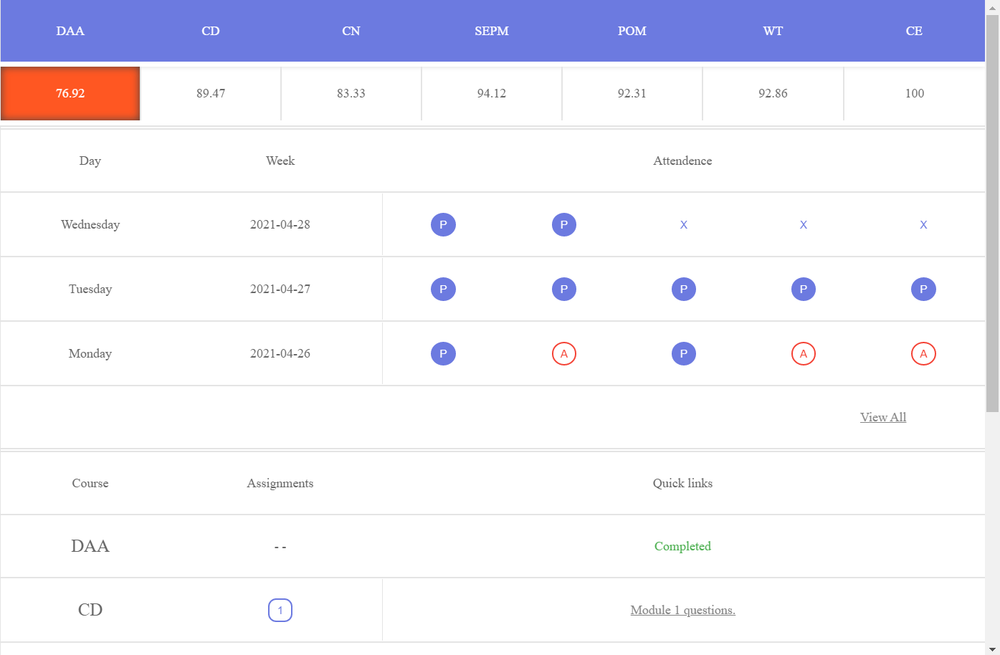
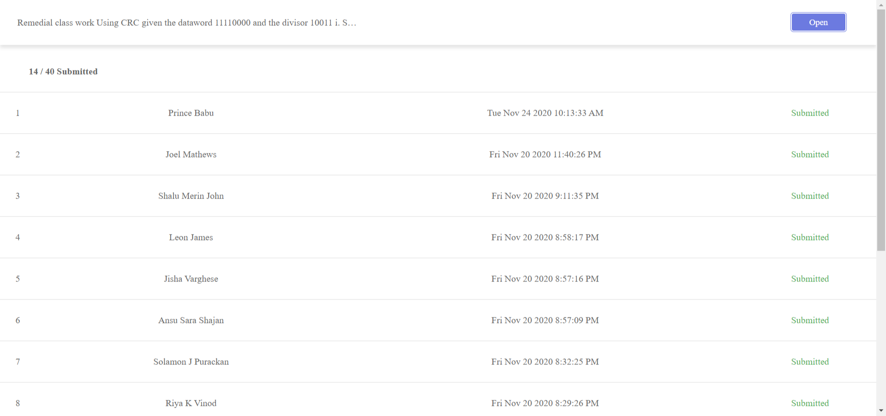

# Mbcbot

Just A bot Tailored for Mbccet Students ;)    

The bot searches in Google classroom for any pending / unsubmitted Assignments, then Generates a report along with its links.

## Demo: [View](https://mbcbot.github.io)

(Only Need to authenticate with the bot once. 
Initial **Loading times may take upto 32 seconds** depending upon the fetched data)

Current MBC Branches with Access to bot:

1. S3 CSE (2019 - 2023 batch)
2. S5 CSE (2018 - 2022 batch)
3. S7 CSE (2017 - 2021 batch)
4. S5 EC (2018 - 2022 batch)
5. S5 ME (2018 - 2022 batch)
6. S5 CE (2018 - 2022 batch)
7. S6 CSE (2018 - 2022 batch)

## Screenshots:

Ver 2.0.1   

Ver 3.1.0   

The Bot also fetches the **list of students** who submitted a Particular Assignment
(This Feature is only Available for S5/S6 CSE)

## Limitation:

1. User must be a Member of the Respective Branch's Google Classrooms (list below) else the bot redirects to error page..

## Classroom Configs for Different Branches:

**1. S3 CSE**

| Classroom ID | Course |
| --- | --- |
| 4125518XXXX | DS |
| 16084414XXXX | LSD |
| 12294392XXXX | OOP |
| 11891809XXXX | DE |
| 12293546XXXX | DMS |
| 11887481XXXX | SE |
| 14981400XXXX | DS LAB |
| 19203495XXXX | OOP LAB |

**2. S5 CSE**

| Classroom ID | Course |
| --- | --- |
| 4125518XXXX | TOC |
| 11891809XXXX | SS |
| 12175621XXXX | MPMC |
| 11891301XXXX | DC |
| 11881794XXXX | GTC |
| 15720454XXXX | ASL |
| 11892287XXXX | DP |
| 11882133XXXX | SC |
| 18981444XXXX | SSL |

**3. S6 CSE**

| Classroom ID | Course |
| --- | --- |
| 31330469XXXX | DAA |
| 30139120XXXX | CD |
| 30155131XXXX | CN |
| 30132144XXXX | SEPM |
| 30161603XXXX | WT |
| 30123797XXXX | POM |
| 28090599XXXX | CE |
| 31322545XXXX | PLC |

**4. S7 CSE**

| Classroom ID | Course |
| --- | --- |
| 4124974XXXX | CG |
| 12293183XXXX | PP |
| 12157426XXXX | CSA |
| 11891814XXXX | DC |
| 11890106XXXX | CNS |
| 12198393XXXX | SPP |
| 11888919XXXX | ML |
| 18773641XXXX | CD LAB |

**5. S5 EC**

| Classroom ID | Course |
| --- | --- |
| 13829308XXXX | DSP |
| 12172208XXXX | AET |
| 12259822XXXX | MPMC |
| 12172665XXXX | PEI |
| 14854393XXXX | PEI LAB |
| 12731888XXXX | DP |
| 12173386XXXX | BE |
| 13857451XXXX | POM |

**6. S5 ME**

| Classroom ID | Course |
| --- | --- |
| 14319858XXXX | EDCA |
| 11879075XXXX | POM |
| 12989035XXXX | MOM |
| 13810441XXXX | MTDM |
| 11891606XXXX | CPNM |
| 11927550XXXX | DP |
| 11878929XXXX | NDT |

