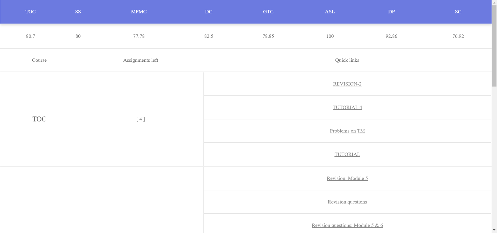

# Mbcbot

Just A bot Tailored for S5 CSE Mbccet Students ;)

## Demo: [View](https://mbcbot.github.io)

(Only Need to authenticate with the bot once)

## Screenshots:

The Bot also fetches for students who submitted the Assignments

Notifies if No student has submitted.

The Bot can also send a documented self message to the user's whatsapp
(whatsapp number taken from database and Protected from third party access)

Detailed View:-

## Scopes:

1. https://www.googleapis.com/auth/script.external_request
2. https://www.googleapis.com/auth/userinfo.email
3. https://www.googleapis.com/auth/classroom.coursework.me

## Working:

1. Splits Admission number from organization email
1. Scraps User Attendance from http://mbccet.com/login.php by passing required parameters(Admsn no.)
2. Gets Assignment submission details for the required courses(using course id's pre-specified in the code)
3. Generates Corresponding Classroom link and Assignment Submission Details of other students
3. Displays the output
