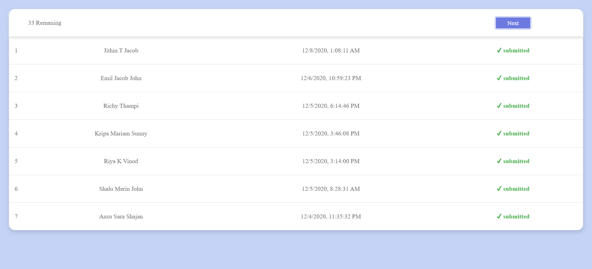
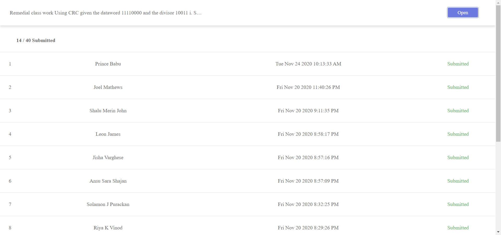
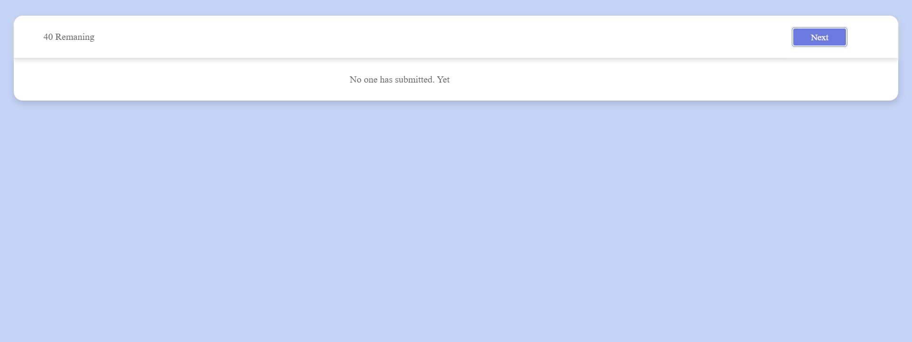
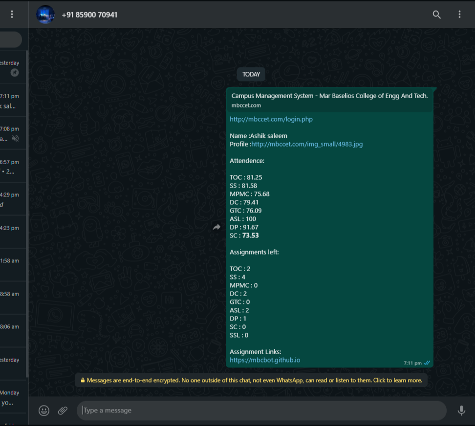
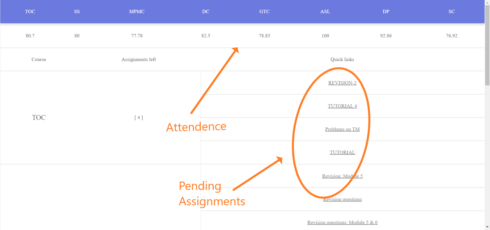

# Mbcbot

Just A bot Tailored for Mbccet Students ;)

## Demo: [View](https://mbcbot.github.io)

(Only Need to authenticate with the bot once)

Current MBC Branches with Access to bot:

1. S3 CSE
2. S5 CSE
3. S7 CSE
4. S5 EC
5. S5 ME

## Screenshots:

The Bot also fetches for students who submitted the Assignments
(Feature Available only for S5 CSE)

Notifies if No student has submitted.

The Bot can also send a documented self message to the user's whatsapp
(whatsapp number taken from database and Protected from third party access)
(This Feature has been Rollbacked and is now deprecated)

Detailed View:-

## Scopes:

1. googleapis/auth/script.external_request
2. googleapis/auth/userinfo.email
3. googleapis/auth/classroom.coursework.me.readonly

